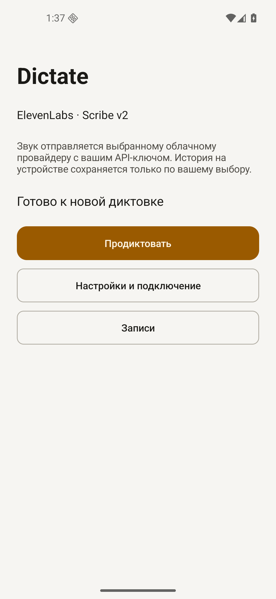
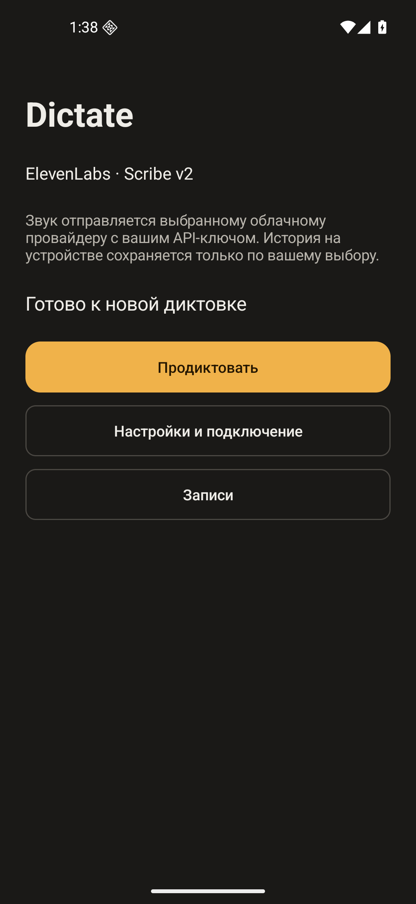
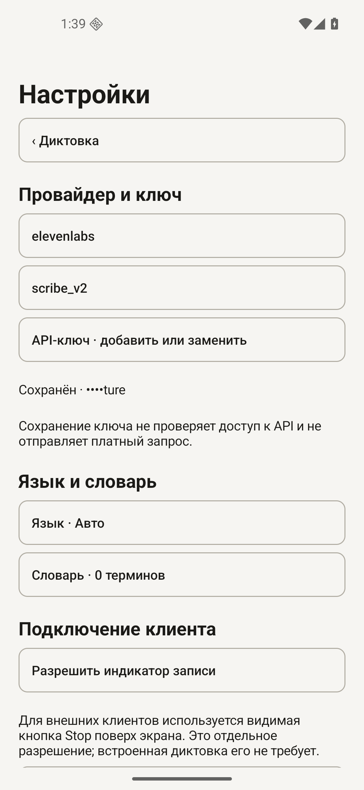
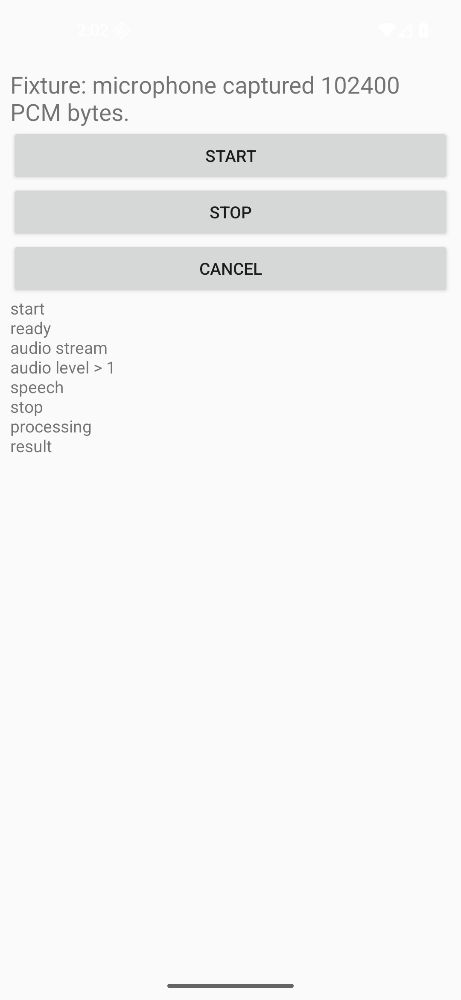

# Проверки

Здесь разделены проверки своего кода и доступность облачных моделей. Зелёная сборка не означает, что любая клавиатура или платный аккаунт совместимы.

## Локально и в CI

```bash
./scripts/verify.sh
```

JDK 17, Android SDK 36, AGP 9.4.0, Gradle Wrapper 9.7.1. `test` запускает JVM-тесты логики и HTTP-контрактов, `lintDebug lintRelease` проверяют обе обычные сборки. Чистый checkout не требует API-ключа или ключа подписи.

- Логика: stop/cancel, токены владельцев, допуск UID, язык/script, словарь, WAV и обрезка тишины.
- Контракты: пять transport-форматов, auth, URL, payload, `store=false`, успешные и неполные ответы; reasoning не становится текстом диктовки.
- HTTP: отказ от redirects/retry, 401/403/402/429/5xx, слишком большой/невалидный ответ, отмена открытого соединения. MockWebServer работает локально, без облака.
- Хранилище Android: Keystore, повреждение IV, квота, delete/clear, битый индекс, сохранение PCM при восстановлении и legacy migration.
- Отдельный UID: пустой allowlist, холодный запуск сервиса, реальный AudioRecord, cancel/restart, no-speech, второй клиент/busy и неподдерживаемые extras.

## Виртуальный микрофон

Workflow [Android integration](../.github/workflows/android.yml) запускает Google APIs x86_64 на API 26, 31, 34 и 36. Результаты привязаны к commit в Actions, не к названию ветки. Локальный дополнительный прогон — API 36 arm64 на macOS.

Скрипт `scripts/emulator_smoke.py` проходит обычные экраны выдачи разрешений и добавления клиента. Перед записью оба процесса принудительно закрываются: недавнее открытие настроек не должно скрывать запрет фонового микрофона. Root, AppOps grants и изменение системного speech provider не используются.

Через авторизованный gRPC на localhost вводится синус 440 Гц, PCM16 mono 16 кГц. Буферизованная доставка ждёт потребления аудио эмулятором; доступ к микрофону хоста выключен. Приложение читает AudioRecord в 16 кГц; fixture проверяет активные окна сигнала, затем возвращает явно подписанный текст. Это проверка аудиотракта и IPC, не качества распознавания речи. Файлы личной речи не используются. В `release` fixture не компилируется.

Запуск на уже созданном эмуляторе:

```bash
emulator -avd Dictate_API36 -no-snapshot -grpc 8554 -grpc-use-token -allow-host-audio
./gradlew :app:assembleIntegration :sample-client:assembleDebug
adb -s emulator-5554 install app/build/outputs/apk/integration/app-integration.apk
adb -s emulator-5554 install sample-client/build/outputs/apk/debug/sample-client-debug.apk
uv run scripts/emulator_smoke.py --sdk "$ANDROID_HOME" --screenshots build/emulator-report
```

Скрипт принимает только serial эмулятора. После `onReadyForSpeech` он ждёт первого прочитанного аудиобуфера: Emulator 37.1.11 на macOS может падать внутри `audio_forwarder_enable`, если инъекция начинается раньше. Для синхронизации используется событие, не задержка наугад.

## Подписанная сборка

На API 36 локально проверены установка release, настройка тестового ключа, запись синтетического аудио без HTTP и контролируемое обновление versionCode 2 → 3 тем же сертификатом. Ключ, настройки и аудио сохранились. Это не миграция с личной сборки и не обновление с подписанного `v0.1.0`: такого релиза не было.

Для повторения на чистой тестовой установке: `--release-check --upgrade-apk <signed-newer.apk>`. Скрипт использует заведомо недействительный ключ, не нажимает распознавание и не делает запросов провайдерам. Перед публикацией дополнительно проверяется APK, скачанный из черновика GitHub Release.

## Интерфейс

В release на API 36 просмотрены Home и настройки в русской/английской локали, светлая/тёмная тема, ширина 320 dp со шрифтом 200%. Кнопки остаются в прокручиваемом содержимом, подписи переносятся. TalkBack включался через системный экран: проверены фокус и переход с Home в настройки. Это небольшой ручной smoke, не полноценный аудит доступности.

  

Это реальные снимки release на эмуляторе, без дорисовки. В настройках показан маскированный недействительный ключ из проверки обновления. Он не использовался для запросов.



Отдельный клиент с `integration`-сборкой: callbacks проходят через SpeechRecognizer, а текст явно обозначен как fixture. Это не облачное распознавание.

## Внешние API

Live API: **not run — credentials not provided**. Каталог не является заявлением, что все модели доступны любому аккаунту. Основа fixtures: [ElevenLabs STT](https://elevenlabs.io/docs/api-reference/speech-to-text/convert), [OpenRouter STT](https://openrouter.ai/docs/api/api-reference/stt/create-transcription), [OpenRouter audio](https://openrouter.ai/docs/guides/overview/multimodal/audio), [Google transcription](https://ai.google.dev/gemini-api/docs/transcribe), [Google Interactions](https://ai.google.dev/gemini-api/docs/interactions-overview).

Физические телефоны, OEM-ограничения, качество реальной речи и доступность конкретной закрытой клавиатуры не проверены. Автоматические тесты не заменяют эти проверки.
